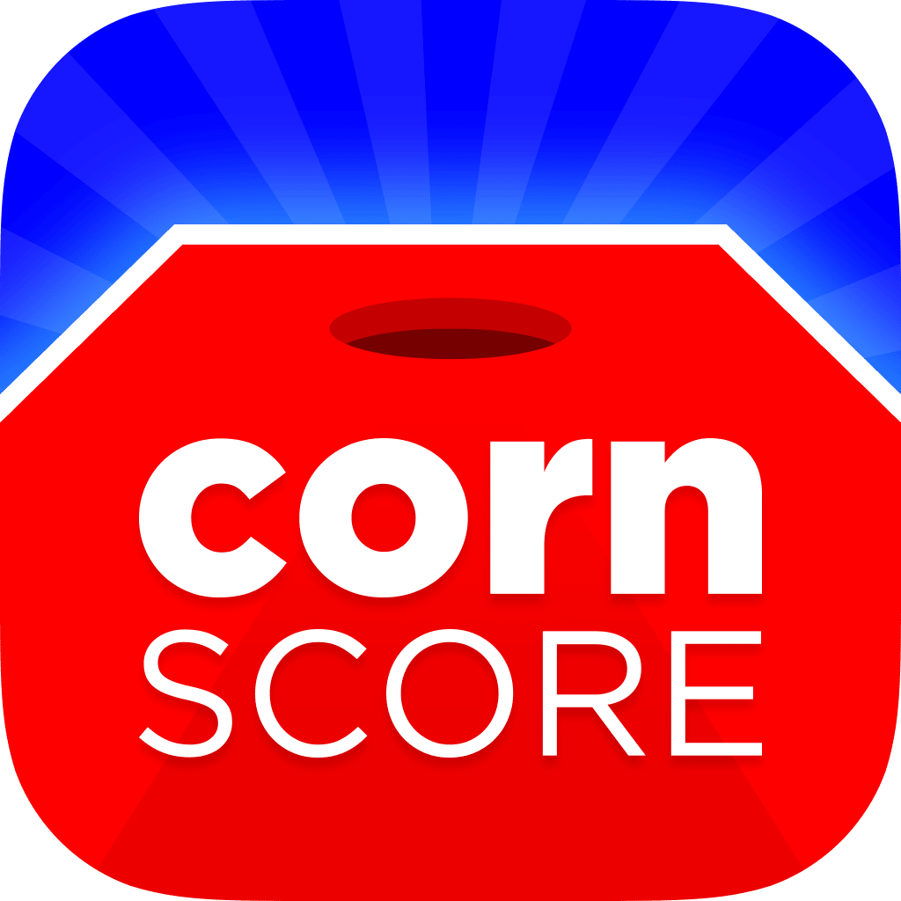
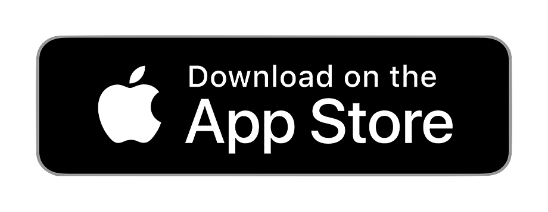

  

# Corn Score 💯

A simple iOS app where users can keep track of an ongoing corn hole game. The app is free on the iOS app store and is completely open source!

  

## Get Involved 🤝🏻
If you would like get involved in the future creation of this iOS app, there are two things you can do! Request new features for future versions or report existing bugs. This can be one of two ways: 

1. On this page go to *Issues* -> *New Issue*. Write up the title & body of the issue with a label of either "enhancement" or "bug".
2. Within the Corn Score app go to *Settings* -> *"Request A New Feature"* / *"Report A Bug"* and fill out the form there.

## Third Party Libraries 📚

Corn Score is supported by the following awesome Swift libraries and is subject to the licenses there of. Feel free to follow these developers & utilize these libraries for your next iOS project.

- [**ProgressHUD**](https://github.com/relatedcode/ProgressHUD)
- [**SAConfettiView**](https://github.com/sudeepag/SAConfettiView)

## Support ☕️

If you enjoy the app being free, and you feel like this repository is a great learning space for building iOS apps and the Swift programming language, then feel free to help support further development by keeping me fueled with coffee.

  

## Contributing 🐧

At this time Corn Score is not open to other code contributions. This may change in the future, but for now this repository is for showcase / learning purposes only.

## License 🪪
Copyright (c) 2023 Colton Boyd

Permission is hereby granted, free of charge, to any person obtaining a copy of this software and associated documentation files (the "Software"), to deal in the Software without restriction, including without limitation the rights to use, copy, modify, merge, publish, distribute, sublicense, and/or sell copies of the Software, and to permit persons to whom the Software is furnished to do so, subject to the following conditions:

The above copyright notice and this permission notice shall be included in all copies or substantial portions of the Software.

THE SOFTWARE IS PROVIDED "AS IS", WITHOUT WARRANTY OF ANY KIND, EXPRESS OR IMPLIED, INCLUDING BUT NOT LIMITED TO THE WARRANTIES OF MERCHANTABILITY, FITNESS FOR A PARTICULAR PURPOSE AND NONINFRINGEMENT. IN NO EVENT SHALL THE AUTHORS OR COPYRIGHT HOLDERS BE LIABLE FOR ANY CLAIM, DAMAGES OR OTHER LIABILITY, WHETHER IN AN ACTION OF CONTRACT, TORT OR OTHERWISE, ARISING FROM, OUT OF OR IN CONNECTION WITH THE SOFTWARE OR THE USE OR OTHER DEALINGS IN THE SOFTWARE.
